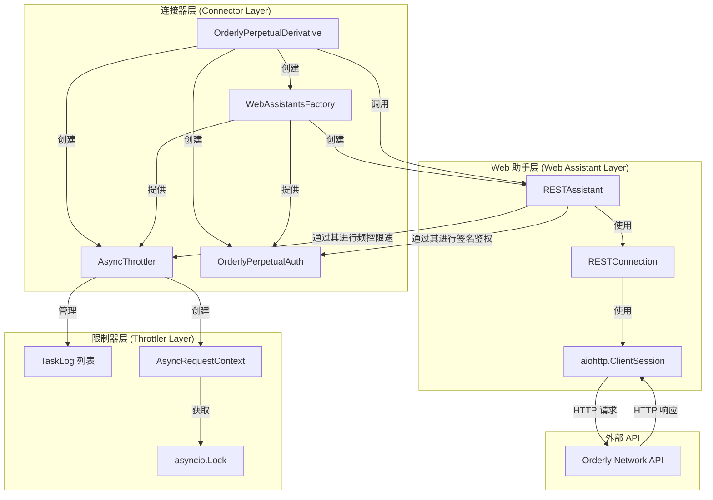
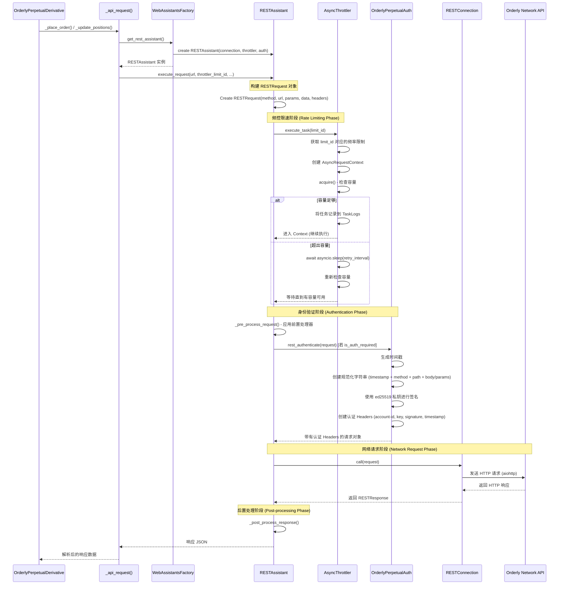
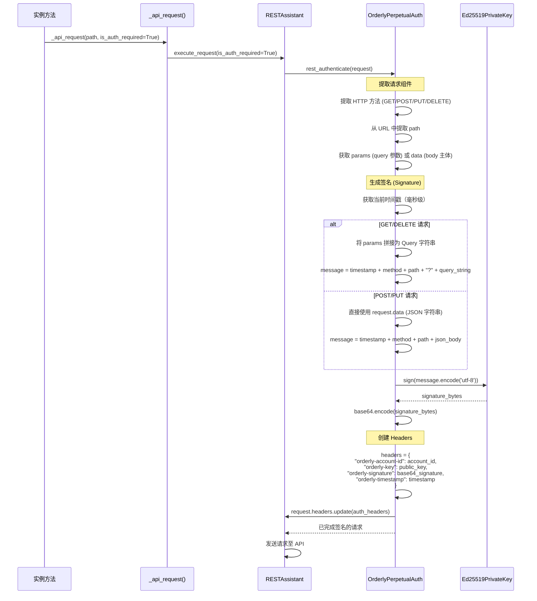
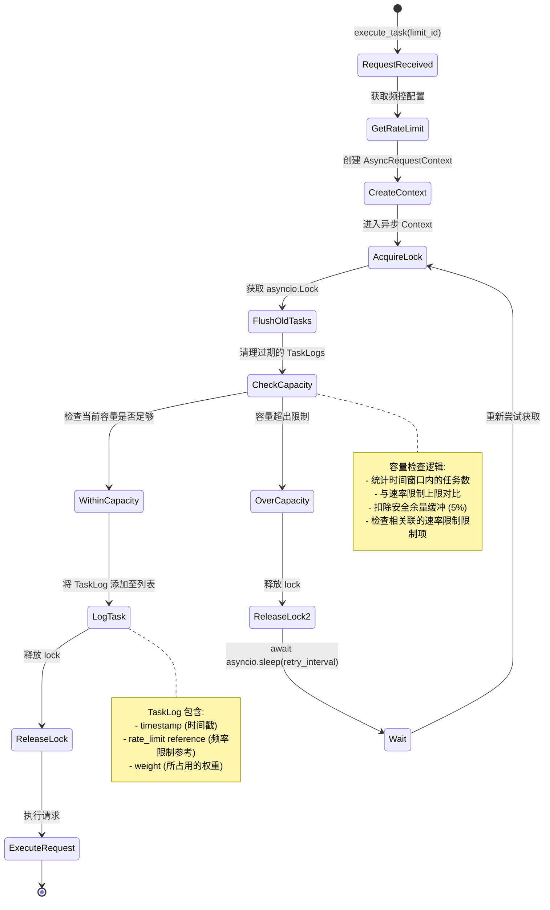
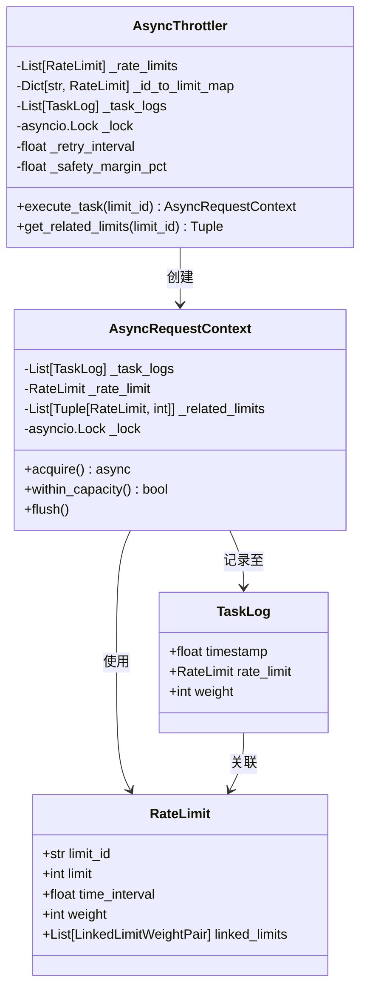
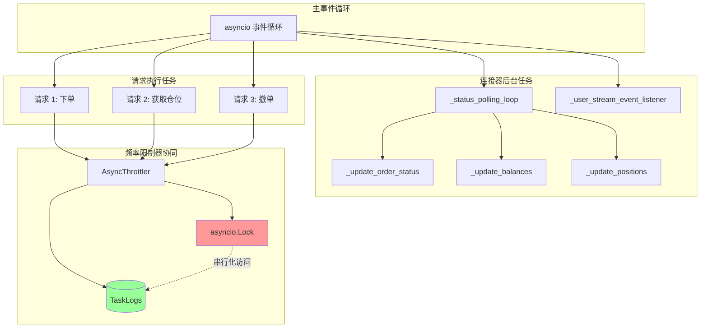
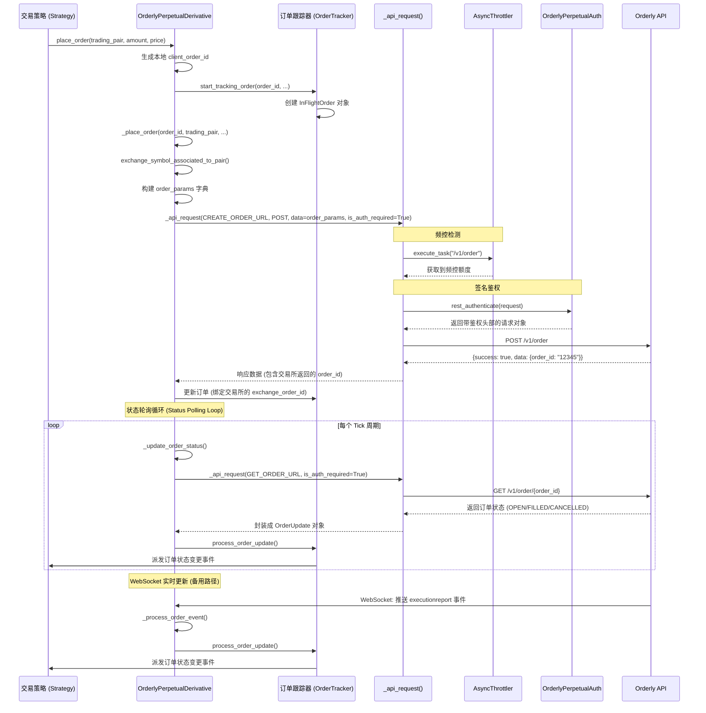
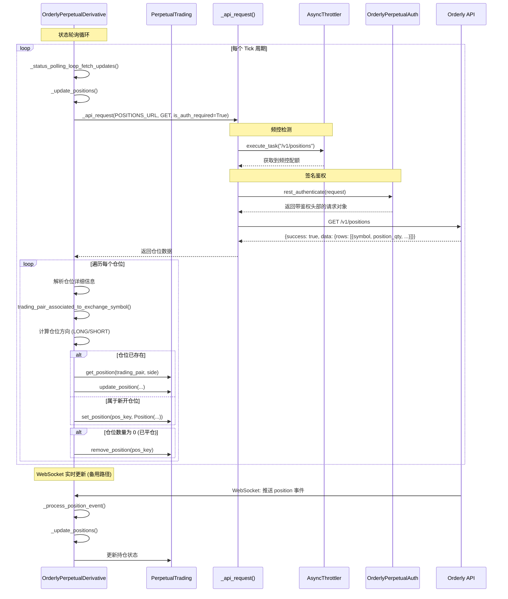

# 连接器架构：请求流程、身份验证和异步处理

本文档详细解释了 Hummingbot 连接器如何处理 API 请求、身份验证、速率限制（Throttling）以及异步操作。

## 目录
1. [高级架构](#高级架构)
2. [请求执行流程](#请求执行流程)
3. [身份验证流程](#身份验证流程)
4. [速率限制器（Throttler）机制](#速率限制器throttler机制)
5. [异步任务处理](#异步任务处理)
6. [订单管理流程](#订单管理流程)
7. [仓位管理流程](#仓位管理流程)

---

## 高级架构



---

## 请求执行流程

该图展示了从连接器方法调用到 API 响应的完整流程：



---

## 身份验证流程

Orderly Network 详细的身份验证处理过程（基于 ed25519 签名）：



**身份验证核心要点：**
- **签名格式**：`{timestamp}{method}{path}{body_or_query}`
- **算法**：Ed25519 椭圆曲线密码学
- **必需的 Headers**：account-id, public key, signature (base64 格式), timestamp
- **时间戳窗口**：Orderly 会验证时间戳差异在 300 秒以内

---

## 速率限制器（Throttler）机制

Throttler 如何管理速率限制和任务排队：



**频控组件结构：**



**频率限制示例 (Orderly Network):**
```python
RateLimit(
    limit_id="/v1/order",
    limit=100,              # 每秒 100 次请求
    time_interval=1.0,      # 时间窗口 1 秒
    weight=1,               # 消耗 1 个单位
    linked_limits=[         # 同时也消耗 general（通用）限额
        LinkedLimitWeightPair(limit_id="general", weight=1)
    ]
)
```

---

## 异步任务处理

异步操作是如何协同工作的：



**异步协同关键点：**

1. **Throttler 锁**：`asyncio.Lock` 确保同一时间只有一个任务能检查/修改 TaskLogs 记录。
2. **上下文管理器**：`async with throttler.execute_task()` 确保锁和容量资源的正常获取和释放。
3. **非阻塞式等待**：当频控超出容量时，任务会调用 `asyncio.sleep` 主动出让控制权，让其他协程任务运行。
4. **并发请求**：允许同时发出多个在途的 HTTP 请求，但 Throttler 会确保总频控不超过交易所限制。

**异步示例代码流程：**
```python
# 多个并发请求
async def place_order():
    async with throttler.execute_task("/v1/order"):  # 获取容量配额
        response = await rest_assistant.call(request)  # 非阻塞的 HTTP 请求
        return response

# 以下任务可以并发运行，Throttler 会确保它们符合限频要求
task1 = asyncio.create_task(place_order())
task2 = asyncio.create_task(get_positions())
task3 = asyncio.create_task(cancel_order())

results = await asyncio.gather(task1, task2, task3)
```

---

## 订单管理流程

下单与维护订单状态的完整生命周期：



**订单生命周期状态：**
- `PENDING_CREATE`：订单已在本地创建，等待交易所确认
- `OPEN`：订单已在挂在交易所深度图上
- `PARTIALLY_FILLED`：订单部分成交
- `FILLED`：订单完全成交
- `CANCELED`：订单已被撤销
- `FAILED`：订单下单失败

---

## 仓位管理流程

如何获取和更新仓位信息：



**仓位更新步骤：**

1. **获取仓位**：GET `/v1/positions` 请求返回所有仓位列表。
2. **解析响应**：提取标的符号、仓位数量、开仓均价、未实现盈亏（uPnL）。
3. **符号转换**：将交易所的 symbol（例如 `PERP_BTC_USDC`）转换为 Hummingbot 的 trading pair（如 `BTC-USDC`）。
4. **判断方向**：仓位数量 > 0 时为多头 (LONG)，数量 < 0 时为空头 (SHORT)。
5. **更新状态**：更新本地已有仓位记录，或者新建仓位。
6. **清理 0 仓位**：如果仓位数量归零，则将其从跟踪列表中移除。

---

## 核心组件概述

### 1. **连接器** (`OrderlyPerpetualDerivative`)
- 继承自 `PerpetualDerivativePyBase`。
- 维护交易对、订单列表和仓位数据。
- 初始化 `WebAssistantsFactory` 并注入频控器（Throttler）和签名认证器（Auth）。
- 实现具体的下单、撤单、状态更新和仓位查询逻辑。

### 2. **WebAssistantsFactory**
- 工厂模式，用于创建 REST/WebSocket Assistant 助手实例。
- 负责向助手实例中注入 throttler，auth 模块及前置/后置过滤器。

### 3. **RESTAssistant**
- 对底层 RESTConnection 进一步包装，引入频率控制和认证签名。
- 应用前置过滤器（如填充 headers，同步时间戳）。
- 应用后置过滤器（如接口统一报错解析和 JSON 转化）。

### 4. **AsyncThrottler**
- 对应各个接口细分终点的速率限制管理。
- 使用滑动时间窗口记录并统计已发起的任务。
- 使用 `asyncio.Lock` 确保多协程环境下的线程安全。
- 提供异步 Context Manager 模式来阻塞/释放请求配额。

### 5. **OrderlyPerpetualAuth**
- 实现 `AuthBase` 鉴权接口。
- 利用 Ed25519 密钥算法生成加密签名。
- 构造请求参数/主体的标准规范化文本。
- 为所有的私有接口请求附加相应的鉴权 headers。

### 6. **RESTConnection**
- 最底层的 HTTP 客户端网络封装。
- 采用 `aiohttp.ClientSession`。
- 处理真实的网络 I/O 数据读写。

---

## 采用的异步模式 (Async Patterns)

1. **异步上下文管理器**：使用 `async with throttler.execute_task()` 规范化获取频控的资源周期。
2. **异步锁**：`asyncio.Lock` 避免多协程同时更改 TaskLogs 发生并发竞态冲突。
3. **异步睡眠**：频控超限时，利用非阻塞的挂起等待，出让事件循环时间。
4. **任务并行化**：利用 `asyncio.gather()` 支持在途的多个接口并发调用。
5. **后台轮询任务**：状态心跳、行情及账户数据拉取以独立后台协程运行。
6. **WebSocket 异步流**：异步迭代器用于接收实时的流式推送事件。

---

## 频率限制策略

频率限制器使用 **滑动窗口 (Sliding Window)** 计数法：

1. **任务日志**：每次成功发送请求都会将执行时刻及权重计入 TaskLogs。
2. **容量检查**：发送前，剔除时间窗口之外的过期记录，并对比当前时间窗口内的请求额度。
3. **超限等待**：如果数量达到配置阈值，休眠一小段时间后重新检查。
4. **安全余量**：应用 5% 的安全容错缓冲比例，确保在大并发时不会因微小网络延迟导致踩线被限流。

---

## 错误处理

1. **网络连接错误**：由底层 Connection 捕获并按规则进行指数退避重试。
2. **频率限制限制 (429)**：Throttler 拦截，休眠等待后自动进行重试。
3. **签名验证失败**：抛出至 Connector 层，一般标识为凭证/签名失效错误。
4. **API 业务报错**：响应被解析后，抛出特定带有具体 code 的 `IOError` 异常。
5. **超时报错**：使用 `wait_for` 设定最大时限进行超时中断保护。
